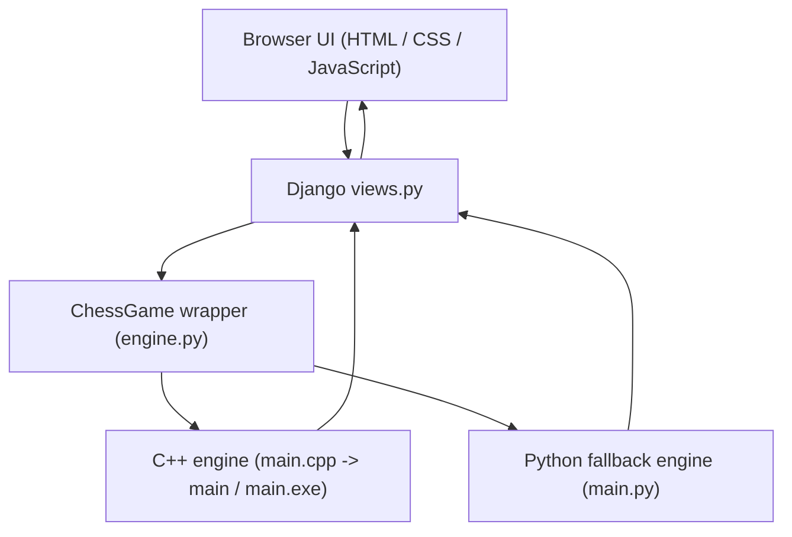

# Checkora Architecture

Checkora is a Django-based chess platform with a layered request flow:

## 1) High-Level Layers

### Browser UI
- `game/templates/game/board.html` renders the chessboard, clocks, controls, and overlays.
- `game/static/game/js/board.js` handles clicks, drag/drop, move hints, AI requests, and status updates.
- `game/static/game/css/board.css` controls the board layout, themes, overlays, and responsive behavior.

### Django Application Layer
- `game/views.py` exposes the page render and API endpoints.
- `game/urls.py` maps browser routes to those views.
- `game/tests.py` covers the request flow and protects the AI/move logic.

### Engine Layer
- `game/engine.py` translates board state into engine commands.
- `game/engine/main.cpp` is the primary chess engine implementation.
- `game/engine/main.py` mirrors the C++ logic as a fallback when the compiled binary is unavailable.

## 2) Move Flow

1. The player makes a move in the browser.
2. JavaScript sends the move to Django through an API request.
3. Django validates the request and passes the board state to `ChessGame`.
4. `ChessGame` serializes the position and calls the engine subprocess.
5. The engine returns the updated board, move history, and game status.
6. Django sends the response back to the frontend, which re-renders the board.

## 3) AI Move Flow

When the game is set to AI mode, the browser requests `/api/ai-move/`.

- Django asks the engine to calculate the best move.
- The engine runs its minimax search with alpha-beta pruning.
- The response includes the chosen move, updated board, and game state metadata.

## 4) Engine Fallback Strategy

Checkora prefers the C++ engine for speed.
If the compiled binary cannot run in the current environment, the Python engine provides the same behavior through the same wrapper interface.

This keeps the game playable on platforms where native compilation is limited.

## 5) Key Paths

- Frontend board: `game/templates/game/board.html`
- Frontend behavior: `game/static/game/js/board.js`
- Frontend styling: `game/static/game/css/board.css`
- Django routes: `game/urls.py`
- Django views: `game/views.py`
- Engine wrapper: `game/engine.py`
- Primary engine: `game/engine/main.cpp`
- Fallback engine: `game/engine/main.py`

## 6) Contributor Notes

- Keep UI changes focused on one surface when possible.
- When touching the engine layer, validate both the C++ path and the Python fallback path.
- For docs updates, prefer short diagrams and direct file references over long prose.
